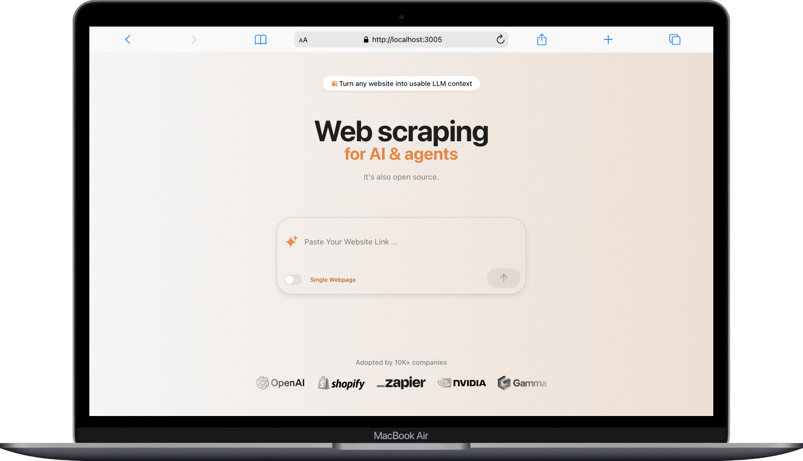
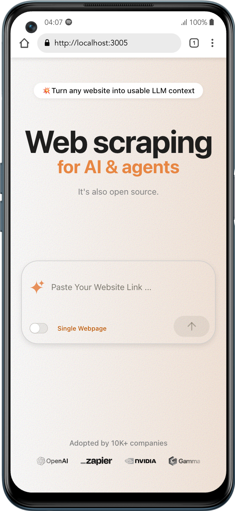
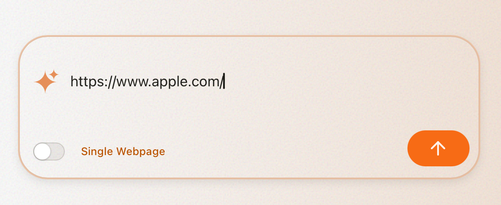
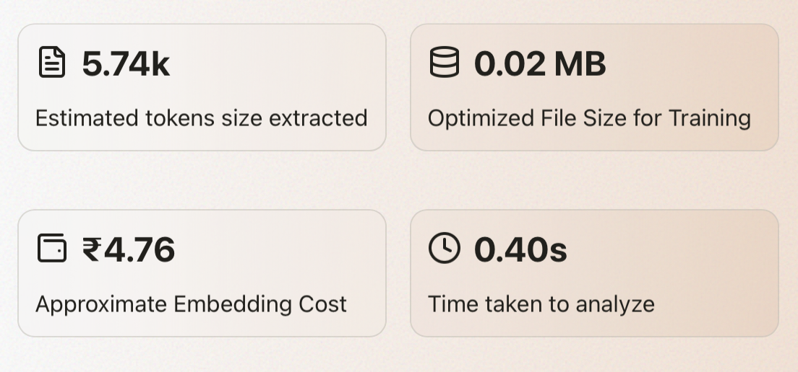
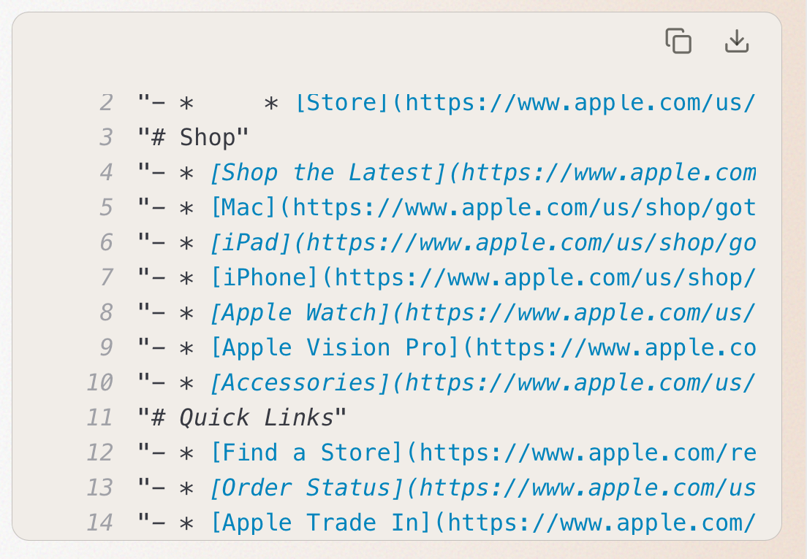

<h2 align="left" style="display: flex; align-items: center;">
  <svg width="40" height="40" viewBox="0 0 24 24" fill="#FFA500" xmlns="http://www.w3.org/2000/svg">
  <path d="M12 0C7.58 0 4 3.58 4 8c0 1.56.47 3.01 1.28 4.24L2 21.41 3.41 23l6.58-3.28C10.99 20.53 11.99 21 13 21c4.42 0 8-3.58 8-8s-3.58-8-8-8z"/>
</svg>
  Web2LLM: Website to LLM-ready .txt Generator 
</h2>


Web2LLM is an ***open-source*** tool that converts any website into an optimized, AI-friendly context file (llm.txt). Perfect for generating training data for Large Language Models (LLMs), it stands out by being ***ultra-fast and highly accurate***  compared to other LLM content generators.


<br>

 &nbsp; &nbsp;
 &nbsp; &nbsp;
 &nbsp; &nbsp;
 &nbsp; &nbsp;

<br> 


<p align="left">
  
  
</p>

<br> 

<br>


> [!IMPORTANT]
>
> ### Why I Built This
> While building my own **RAG AI system**, I struggled with converting websites into clean, LLM-ready `.txt` files.
>
> - Scraping required coding knowledge  
> - Extracted content was messy and unoptimized for LLMs  
> - Estimating token usage and cost was manual and confusing  
> - Non-AI teammates couldn’t help — leading to delays and poor results
>
> This made AI development slow, error-prone, and hard to scale across teams.
>
> ---
> 
> ### How I Solved the Problem
>
> So I created **Web2LLM** — a fast, open-source tool that:
> - Automatically scrapes WebPage and cleans websites  
> - Outputs clean `llm.txt` files ready for AI use  
> - Shows token count, file size, cost, and processing time  
>
> It’s built for both AI developers **and** non-tech users — so anyone can generate clean, structured data for AI projects in seconds.


<br>


##  How It Works: Step-by-Step User Guide

1. **Enter a Website URL**  
   - Start by pasting any public website link (must begin with `https://`) into the input box.  
   - Example: `https://www.apple.com/`

    <br>
    
   

   <br>

2. **Click the “Generate” Button**  
   - Once clicked, the tool will automatically fetch the webpage, clean the content, and prepare it for LLM use.  
   - Processing usually takes just a few seconds.

3. **View the Results**  
   - After processing, you’ll see two main sections:

     - **Metrics Panel** —

        <br> 

        

        <br>


     - 📄 **Downloadable `llm.txt` File** — a clean, LLM-ready text file perfect for:
     
        <br> 

        
        
        <br>


4. **Copy or Download the Output**  
   - You can copy the result to your clipboard or download it directly as `llm.txt`.

> That’s it! In just one click, your raw web content is transformed into structured, AI-ready data.

<br> 

## 5. Summary  
Video To understand the simple workflow and easy management.  


https://github.com/user-attachments/assets/81b78b7e-f1e4-47d1-82a3-57739bb2562d


 &nbsp; &nbsp;
 &nbsp; &nbsp;
 &nbsp; &nbsp;
 &nbsp; &nbsp;
 &nbsp; &nbsp;


<br>

<br>

> [!NOTE]
>
> ### Getting Started is Super Easy 
>
> This project isn’t just easy to use — it’s also **easy to set up and integrate into your own system**. Follow the steps below to get it running on your machine in minutes:
>
> **Step 1:**  
> Clone the repository  
> ```bash
> git clone https://github.com/buildwithfiroz/Web2-LLM.txt.git
> ```
>
> **Step 2:**  
> Move into the project folder  
> ```bash
> cd Web2-LLM.txt
> ```
>
> **Step 3:**  
> Create a virtual environment  
> ```bash
> python3 -m venv myenv
> ```
>
> **Step 4:**  
> Activate the virtual environment  
> - On macOS/Linux:  
>   ```bash
>   source myenv/bin/activate
>   ```
> - On Windows (PowerShell):  
>   ```powershell
>   .\myenv\Scripts\Activate.ps1
>   ```
>
> **Step 5:**  
> Install the dependencies  
> ```bash
> pip install -r requirements.txt
> ```
>
> **Step 6:**  
> Run the app to view admin pannel 
> ```bash
> reflex run
> ```
> <br>
>
> 
> That’s it! You’re now up and running. Feel free to customize or extend the app to fit your workflow.

<br>
<br>

> [!Tip]
> If face Any isues about For Running Reflex Try - 
> 
> ```bash
> rm -rf .web && nvm use 20 
> ```
>
> Then Try Again to run Reflex
<br>

<br> <br>

## 👨‍💻 Author - Contact Information


<br>
<p align="center">
  <a href="https://github.com/buildwithfiroz">
    </a>  &nbsp;  &nbsp;
    <a href="https://github.com/buildwithfiroz/desktop-login-admin-kivymd/blob/main/LICENSE">
    </a>  &nbsp;  &nbsp;
  <a href="https://github.com/buildwithfiroz/desktop-login-admin-kivymd">
    </a> &nbsp;  &nbsp;
  <a href="mailto:buildbyfiroz@icloud.com">
    </a>  
</p>

<br>

<p align="center"><b>Made with ❤️ by Firoz</b></p>

